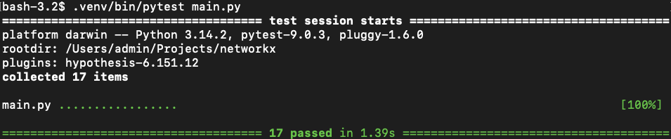

# Property-Based Testing for NetworkX

A collection of property-based tests for [NetworkX](https://networkx.org/documentation/stable/) graph algorithms, written with the [Hypothesis](https://hypothesis.readthedocs.io/) library.

## Test Results



---

## Algorithms Under Test

| Algorithm | NetworkX Function | Properties Tested |
|---|---|---|
| **Dijkstra's Shortest Path** | `single_source_dijkstra` | Invariants, Postconditions, Metamorphic, Idempotence, Boundary |
| **Dinitz Maximum Flow** | `algorithms.flow.dinitz` | Invariants, Postconditions, Metamorphic, Idempotence, Boundary, Commutativity |

---

## Properties Tested

### Dijkstra's Shortest Path

| Category | Test | What it checks |
|---|---|---|
| **Invariant** | `test_self_distance_is_zero` | `dist(v, v) == 0` for every node |
| **Invariant** | `test_all_distances_are_non_negative` | No distance < 0 |
| **Postcondition** | `test_path_cost_matches_returned_distance` | Sum of edge weights along path == reported distance |
| **Postcondition** | `test_returned_paths_are_valid` | Path starts at source, ends at target, uses real edges only |
| **Metamorphic** | `test_weight_scaling_scales_distances` | Scale all weights by k → distances scale by k, paths unchanged |
| **Metamorphic** | `test_symmetry_on_undirected_graphs` | `dist(u, v) == dist(v, u)` on undirected graphs |
| **Idempotence** | `test_dijkstra_is_idempotent` | Two runs on same graph → identical results |
| **Boundary** | `test_single_node_graph` | Single node → only `{node: 0.0}` in result |
| **Boundary** | `test_edgeless_graph_only_source_reachable` | No edges → only source appears in result |
| **Boundary** | `test_disconnected_nodes_absent_from_result` | Unreachable nodes never appear in output |

### Dinitz Maximum Flow

| Category | Test | What it checks |
|---|---|---|
| **Invariant** | `test_max_flow_equals_min_cut` | `max_flow(s,t) == min_cut(s,t)` (Ford-Fulkerson theorem) |
| **Invariant** | `test_flow_conservation_at_internal_nodes` | Flow in == flow out at every internal node |
| **Invariant** | `test_positive_flow_never_exceeds_capacity` | `0 ≤ flow(e) ≤ capacity(e)` for every edge |
| **Postcondition** | `test_flow_value_is_non_negative` | Max flow value is always ≥ 0 |
| **Postcondition** | `test_flow_out_of_source_equals_flow_into_sink` | Source out = sink in = reported flow value |
| **Boundary** | `test_zero_flow_when_source_equals_sink` | `s == t` → flow is 0 |
| **Boundary** | `test_zero_flow_when_no_path` | No path s→t → flow is 0 |
| **Boundary** | `test_single_edge_graph_flow_equals_capacity` | One edge `(s,t,cap)` → flow == cap |
| **Idempotence** | `test_dinitz_is_idempotent` | Two runs on same graph → identical flow value |
| **Metamorphic** | `test_increasing_capacity_never_decreases_flow` | Larger capacity → flow never drops |
| **Metamorphic** | `test_symmetric_graph_same_flow_both_directions` | `flow(s,t) == flow(t,s)` on symmetric graphs |
| **Commutativity** | `test_parallel_edges_equal_summed_capacity` | Two parallel edges == one merged edge with summed capacity |

---

## Getting Started

### 1. Clone the repository

```bash
git clone https://github.com/your-username/networkx-property-tests.git
cd networkx-property-tests
```

### 2. Create and activate a virtual environment

```bash
python -m venv venv
source venv/bin/activate
```

### 3. Install dependencies

```bash
pip install -r requirements.txt
```

### 4. Run all tests

```bash
pytest main.py -v
```

### 5. Run a specific test

```bash
pytest main.py::test_max_flow_equals_min_cut -v
```

### 6. Run only Dijkstra or Dinitz tests

```bash
# Dijkstra tests only
pytest main.py -v -k "dijkstra"

# Dinitz tests only
pytest main.py -v -k "flow"
```

### 7. See Hypothesis generated examples live

```bash
pytest main.py -v -s
```

---

## Project Structure

```
networkx/
├── main.py              # All property-based tests (Dijkstra + Dinitz)
├── requirements.txt     # Dependencies (networkx, hypothesis, pytest)
└── readme.md            # This file
```

---

## Dependencies

| Package | Purpose |
|---|---|
| `networkx` | Graph algorithms under test |
| `hypothesis` | Property-based test engine — generates and shrinks inputs |
| `pytest` | Test runner |

---

## Key Concepts

**Property-based testing** — instead of asserting `f(2) == 4`, you assert `f(x) > 0 for all valid x`. Hypothesis finds the inputs that break your property.

**Shrinking** — when Hypothesis finds a failing input, it automatically reduces it to the smallest possible failing case, making debugging easier.

**Strategies** — `@st.composite` functions that describe *how* to generate inputs (graphs, nodes, capacities). Hypothesis uses these to generate hundreds of test cases per run.